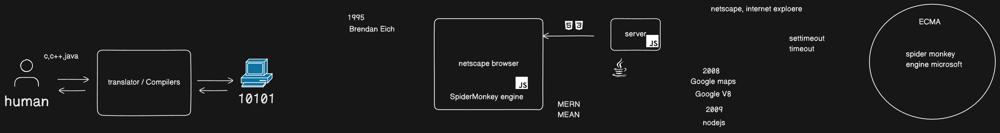

# Points explained

- Programming languages emerged by using the concept of human translation
- This type of translator is known as compiler in computer science
- 1995 netscape was the first browser which only server static sites using html and css
- 1995 was the time when Brendan wrote the first Js engine to give dynamic behavior to websites
- JavaScript has nothing to do with Java it was named due to a marketing strategy.
- Ecma was the organization to stop the browser and js engine was and brought every one under the same umbrella.
- 2008 Google developed the fastest Js engine V8 to support google maps
- 2009 Ryan used the same engine to develop nodejs which enable js to run at server side.
- By Birth of Nodejs all the startups moved to js based echo system due to the same language on front end and backend
- This is why MERN stack and MEAN stack got popularity.

