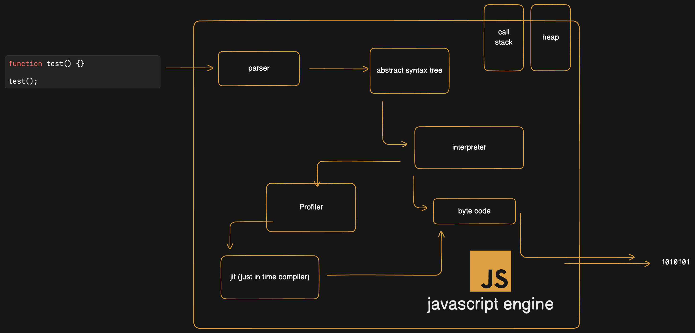

# Points Discussed

- Parser which converts code to ast (abstract syntax tree)
- Intrepreter which converts ast to byte code.
- Byte code is one level higher than machine code.
- Byte code helps to make things platform independent
- Byte code is then converted to machine code
- Profile constantly looks how the interperter translates ast to bytecode and pass the data to jit.
- Jit optimizes things at runtime and updates the byte code for faster performance.
- Call stack and heap helps in javascript code execution and are kept in ram.

