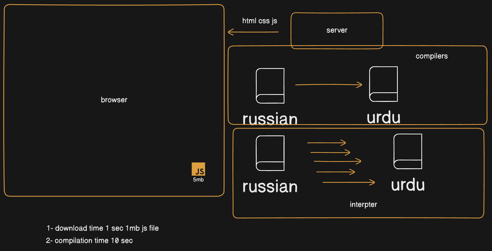

# Points Explained

- Compilers need the completed source code to generate optimized machine code which results in larger compilation time.
- Interpreters are instant and starts executing line by line.
- Js is interpreted because we want to reduce the delay time and starts execution of code instantly.

